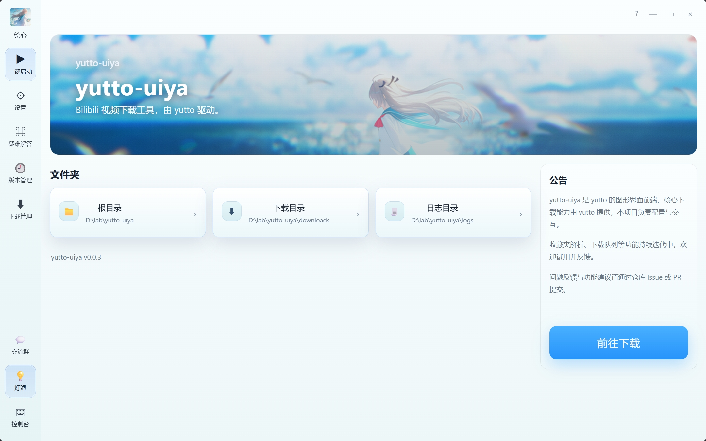
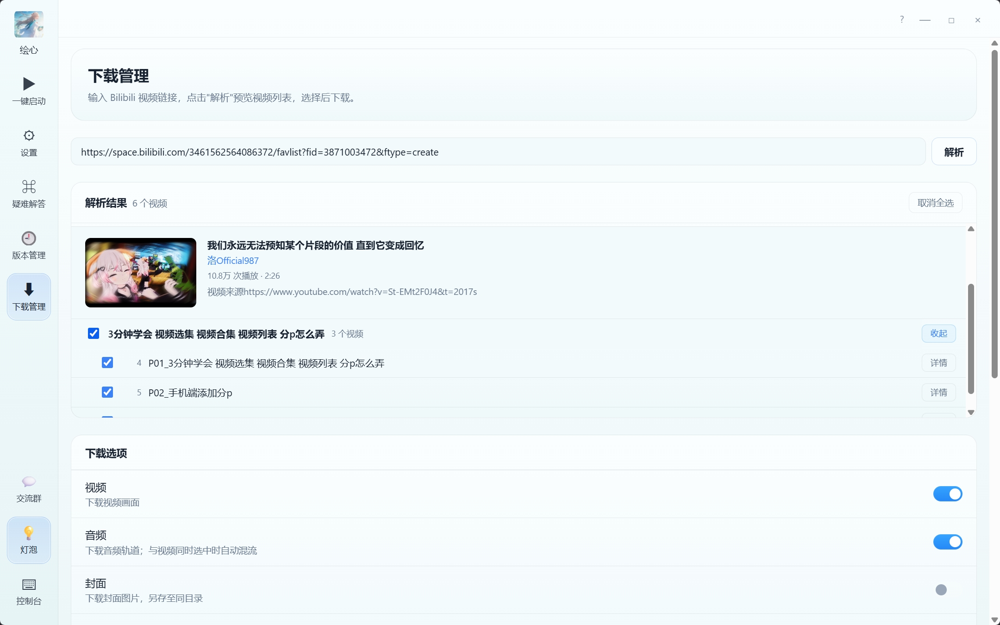
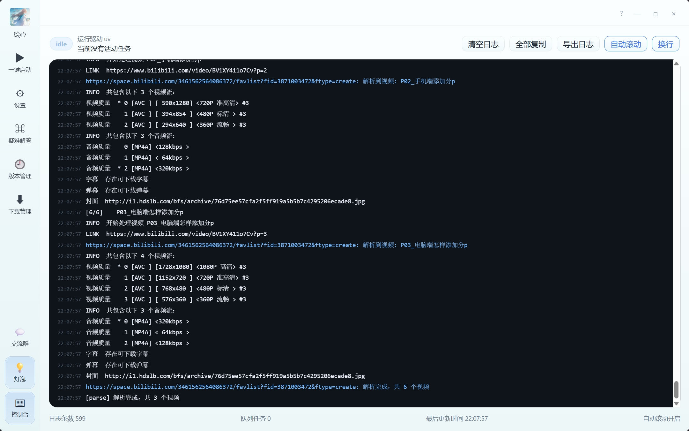

<p align="center">
  <a href="https://xnnehang.top/">
    
  </a>
</p>

<h1 align="center">绘心 yutto-uiya</h1>

<p align="center">
  yutto 的图形界面前端，Bilibili 视频下载工具
</p>

<p align="center">
  
  
  
  
</p>

---

> 核心下载能力由 [yutto](https://github.com/yutto-dev/yutto) 提供，本项目负责配置、解析与交互界面。

## 截图

| | |
|---|---|
|  |  |
|  |  |

## 功能

- **视频 / 收藏夹 / 合集解析** — 输入 URL 自动识别类型，支持批量解析与分组展示
- **视频详情预览** — 展示封面、标题、UP 主、时长、播放量
- **批量选择下载** — 全选 / 按组选 / 单条选，灵活组合
- **下载选项** — 可选视频、音频、封面；支持指定画质
- **下载队列** — 实时进度、取消任务、完成后直接打开目录
- **Bilibili 账号登录** — 扫码登录，支持大会员内容
- **控制台日志** — 实时输出、自动滚动、一键导出
- **环境配置** — 检测 Python / FFmpeg / uv 环境状态，支持自定义路径
- **代理设置** — 一键关闭系统代理

## 技术栈

| 层 | 技术 |
|---|---|
| 桌面壳层 | Tauri 2 |
| 前端 | React 18 + TypeScript + Vite |
| 后端命令 | Rust |
| 运行时 | Python ≥ 3.11，通过 `uv` 管理 |
| 下载核心 | [yutto](https://github.com/yutto-dev/yutto) |

## 快速开始

### 依赖

- [Node.js](https://nodejs.org/)
- [Rust](https://www.rust-lang.org/tools/install)
- [uv](https://docs.astral.sh/uv/getting-started/installation/)
- [FFmpeg](https://ffmpeg.org/)（系统 PATH 或在设置中指定路径）

### 开发运行

```bash
npm install
npm run tauri dev
```

### 打包

```bash
npm run tauri build
```

## 相关链接

- [yutto](https://github.com/yutto-dev/yutto) — 本项目使用的下载核心
- [XnneHangLab](https://github.com/XnneHangLab/XnneHangLab) — 主仓库
