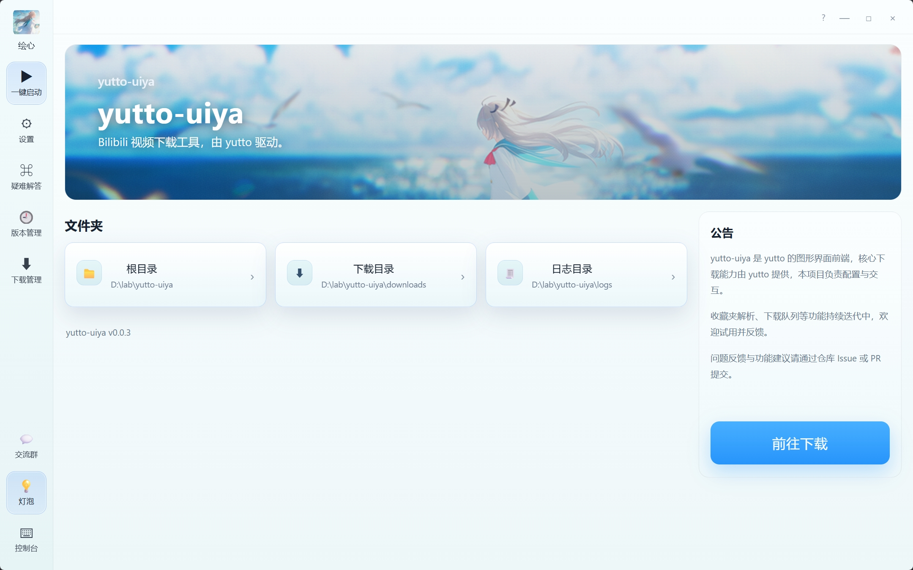
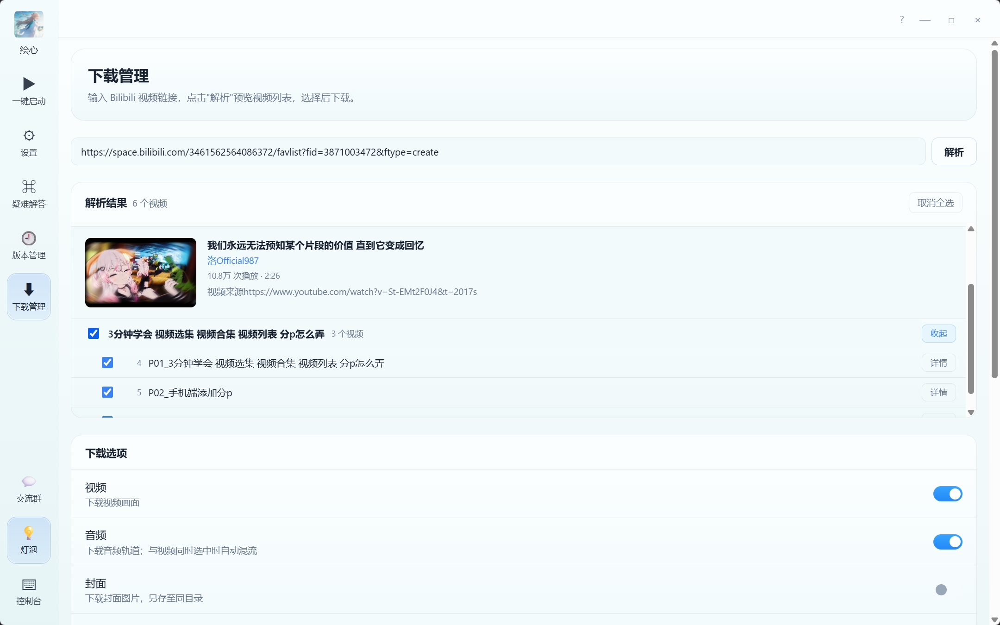
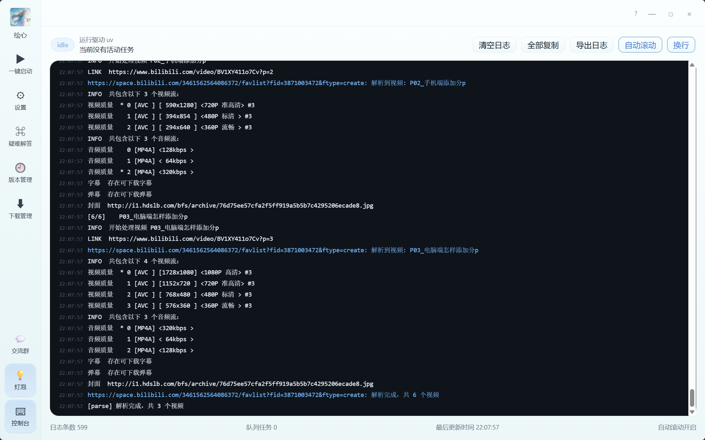

<p align="center">
  <a href="https://xnnehang.top/">
    
  </a>
</p>

<h1 align="center">✨ 绘心 yutto-uiya</h1>

<p align="center">
  yutto 的图形界面前端，Bilibili 视频下载工具 ~
</p>

<p align="center">
  
  
  
  
</p>

<p align="center">
  <a href="https://yutto.xnnehang.top">📖 文档</a> ·
  <a href="https://www.bilibili.com/video/BV1yRdBBsEGZ/">🎬 视频教程</a> ·
  <a href="https://github.com/XnneHangLab/yutto-uiya/releases">📥 下载</a>
</p>

---

> [!NOTE]
> 核心下载能力由 [yutto](https://github.com/yutto-dev/yutto) 提供，本项目负责配置、解析与交互界面。

## 📸 截图

| | |
|---|---|
|  |  |
|  |  |

## 🎯 功能

- 🎬 **视频 / 收藏夹 / 合集解析** — 输入 URL 自动识别类型，支持批量解析与分组展示
- 🖼️ **视频详情预览** — 展示封面、标题、UP 主、时长、播放量；番剧分集含发布方、简介、标签与发布时间
- ✅ **批量选择下载** — 全选 / 按组选 / 单条选，灵活组合
- 🎵 **多格式导出** — 支持 m4a / mp3 / flac / wav 音频格式导出
- ⚙️ **下载选项** — 可选视频、音频、封面；支持指定画质与 AV1 视频编码偏好
- 📊 **下载队列** — 实时进度、实际画质/编码/转码动作、取消任务与完成后直接打开目录
- 🔑 **Bilibili 账号登录** — 扫码登录，支持大会员内容
- 📋 **控制台日志** — 实时输出、自动滚动、一键导出
- 🔍 **环境配置** — 正式版内置 Python 与 FFmpeg；开发构建支持 uv / 自定义 Python
- 🌐 **代理设置** — 一键关闭系统代理

## 📖 使用指南

| 方式 | 链接 |
|---|---|
| 🎬 视频教程 | [Bilibili — 完整使用教程](https://www.bilibili.com/video/BV1yRdBBsEGZ/) |
| 📖 文档站 | [yutto.xnnehang.top](https://yutto.xnnehang.top) |
| 🔧 常见问题 | [FAQ](https://yutto.xnnehang.top/troubleshooting/ffmpeg-not-found) |

## 📦 发行支持

GitHub Releases 提供 Windows x86_64 与 macOS Apple Silicon portable 包，均内置 Python 运行环境、依赖和 FFmpeg，用户无需安装 uv、Conda 或 Python。Linux 当前暂不支持，也不提供 Release 产物。

## 🛠️ 技术栈

| 层 | 技术 |
|---|---|
| 🖥️ 桌面壳层 | Tauri 2 |
| 🎨 前端 | React 18 + TypeScript + Vite |
| ⚙️ 后端命令 | Rust |
| 🐍 运行时 | 正式版内置 Python ≥ 3.11；开发环境通过 `uv` 管理 |
| 📥 下载核心 | [yutto](https://github.com/yutto-dev/yutto) |

## 🚀 开发

详见 [贡献指南](CONTRIBUTING.md)。

```bash
npm install && uv sync
just dev
```

## 🔗 相关链接

- 📥 [yutto](https://github.com/yutto-dev/yutto) — 本项目使用的下载核心
- 🏠 [XnneHangLab](https://github.com/XnneHangLab/XnneHangLab) — 主仓库
