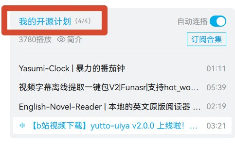

# 合集解析成功但仅解析到一个视频

## 现象

有的合集可以解析全部，但有的只能解析到一个视频。

## 原因

解析的 url 不对，如果使用的是播放中的 url 比如[这个](https://www.bilibili.com/video/BV1yRdBBsEGZ)，是无法解析到所在合集的。

当选择播放中的视频时，只能解析到播放中的视频。虽然侧边栏可以看到合集列表。

## 解决

请点击合集本身，回到 up 空间，找到合集的[源地址](https://space.bilibili.com/556737824/lists?sid=3415704)。
